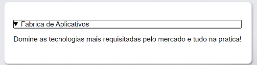
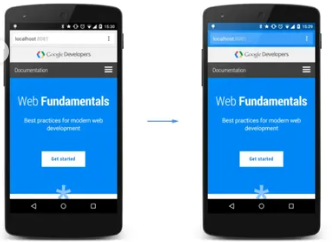

## Tag mark

```html
Dominando as tecnologias com o <mark>Sujeito Programador</mark>
```

Destaca o texto dentro da tag <mark>

## Tag details

```html
<details>
    <summary>Fabrica de Aplicativos</summary>
    <p>Domine as tecnologias mais requisitadas pelo mercado e tudo na pratica!</p>
</details>
```



https://github.com/lucasrmagalhaes/desafios-DIO    (PODE SER USADO COMO BASE)


## Atributo Noopener e Noreferrer

Noopener e Noreferrer são valores do atributo rel que podem ser adicionados a uma tag de âncora a. Eles evitam que as informações de referência sejam transmitidas para o site de destino, removendo as informações de referência do cabeçalho HTTP.

```html
<a href="https://www.seulink.com" target="_blank" rel="noopener noreferrer" > Texto do link externo </a>
```

## Atributo Favicon

Usado para adicionar um ícone ao seu site na aba do navegador.

```html
<link rel="shortcut icon" href="/caminho/favicon.ico">
```

## Atributo viewport

A meta tag viewport controla como um site é exibido em um dispositivo móvel. Ou seja, controla a responsividade do site.

```html
<meta name="viewport" content="width=device-width, initial-scale=1.0" >
```

## Atributo cor do tema

Permite customizar a cor da aba do navegador.

```html
<meta name="theme-color" content="#999999" >
```



## Atributo Imagem srcset

Inclui diversar imagens para que o navegador possa escolher a melhor delas, para mostrar baseada no tamanho do dispositivo que está sendo usado para acessar o seu site.

```html
<picture> 
    <source media="(min-width:650px)" srcset="img.jpg">]
    <source media="(min-width:465px)" srcset="img2.jpg">
    
</picture>
```

Este atributo é necessário quando source é usado em picture

---